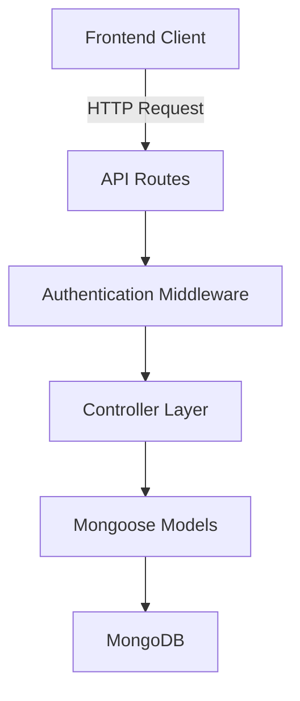

# vidTube-backend

## Introduction

vidTube-backend is a Node.js backend project designed to power a video streaming platform. The repository implements user authentication, video management, channel subscriptions, comments, likes/dislikes, and search features. It provides a RESTful API allowing frontend clients to interact with the application and manage video content.

## Features

- User registration, login, and authentication using JWT tokens.
- CRUD operations for videos.
- Channel creation, subscription, and user management.
- Video like and dislike functionality.
- Comment system for videos.
- Search and filtering for videos.
- RESTful API endpoints for all major actions.
- Follows modular MVC-style architecture with clear separation of controllers, routes, and models.

## Requirements

- Node.js (version 14 or later)
- MongoDB (local or cloud instance)
- npm (Node Package Manager)
- Environment variables for sensitive configuration, such as database URI and JWT secrets

## Installation

1. **Clone the repository**

   ```bash
   git clone https://github.com/abhirawat03/vidTube-backend.git
   cd vidTube-backend
   ```

2. **Install dependencies**

   ```bash
   npm install
   ```

3. **Set up environment variables**

   Create a `.env` file in the root directory. Include the following keys:

   ```
   MONGO_URL=your_mongodb_connection_string
   JWT=your_jwt_secret
   PORT=8800
   ```

4. **Start the server**

   ```bash
   npm start
   ```

   The server will run on `http://localhost:8800` by default.

## Usage

The backend exposes a range of RESTful API endpoints for user, video, and comment management. These endpoints allow the frontend to create, read, update, and delete resources. Most endpoints require authentication via JWT tokens sent in the `Authorization` header.

To use the API with the real routes defined in this repository, follow these steps:

- Start the server using the steps in the **Installation** section.
- Use the server base URL from your environment and the route paths defined in the code.
- Open the Express route files in the repository to see every REST API route, including its HTTP method and URL.
- Call those routes directly from your frontend or API client without changing or reconstructing the paths defined in the code.

---

## Project Structure

The repository follows a modular MVC-like structure:

- **Controllers**: Handle business logic and interact with models.
- **Routes**: Define API endpoints and map them to controllers.
- **Models**: Mongoose models representing MongoDB collections.
- **Middlewares**: Include authentication checks and error handling.
- **Utils**: Utility functions, such as error handling helpers.

### Example Architecture Diagram


